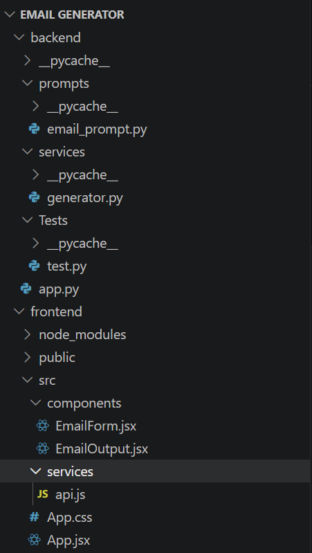
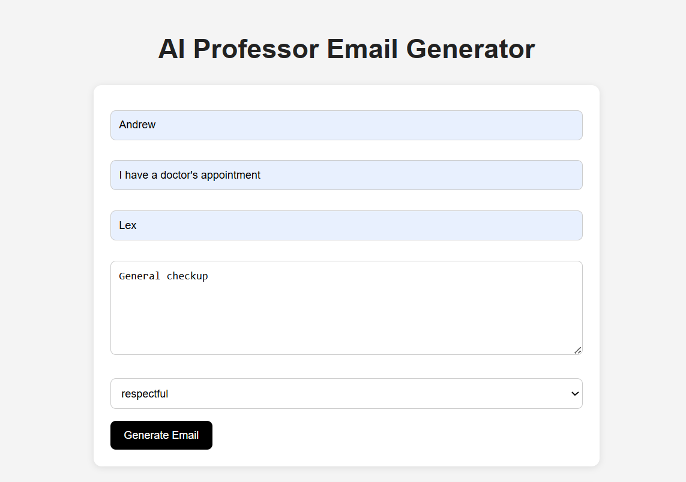
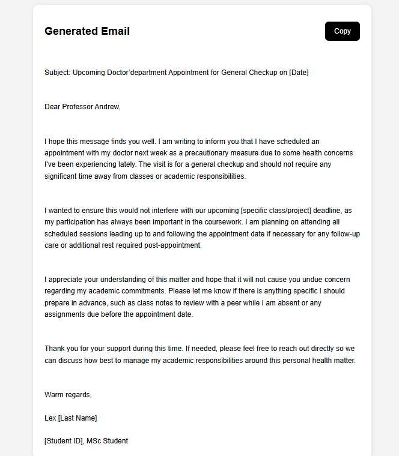

#  AI Email Generator

An AI-powered email generator that creates professional emails using **FastAPI**, **React**, and **local LLMs via Ollama (Phi-3 / LLaMA models)**.

The user fills a simple form → backend processes it using LangChain → AI generates a polished email.

---

## Features

- Generate professional emails instantly
- Multiple tones: respectful, formal, apologetic, urgent
- AI-powered generation using local LLM (Ollama)
- Clean React UI with loading state
- FastAPI backend with structured validation
- LangChain prompt-based generation

---

##  Tech Stack

### Frontend
- React
- Axios
- CSS

### Backend
- FastAPI
- Pydantic
- LangChain
- Ollama (local LLM)

---

## Project Structure



---

##  Backend API

### Endpoint
POST /generate
### Request Body

```json
{
  "professor_name": "Dr. Smith",
  "subject": "Leave Request",
  "student_name": "John",
  "issue": "I am sick and cannot attend class",
  "tone": "respectful"
}

Response

```json
{
  "email": "Generated email content here..."
}

## How It Works

- User submits form in React  
- Data is sent to FastAPI `/generate` endpoint  
- Backend formats prompt using LangChain  
- Ollama model generates email  
- Response is sent back to frontend  
- UI displays generated email  

---

## Frontend Setup

### Form collects:
- Professor Name  
- Subject  
- Student Name  
- Issue  
- Tone  

### On submit:
- Sends POST request to backend  
- Shows loading state ("Generating...")  
- Displays generated email  

---


##  Key Concepts Used

- REST API design  
- Prompt engineering  
- LLM integration (Ollama)  
- Form validation  
- State management in React  
- Async API handling  

---

##  Future Improvements

- Email templates library  
- Save generated emails  
- Copy-to-clipboard feature  
- Email history dashboard  
- Multi-language support  
- Streaming AI response  

---

##  Clone This Project

```bash
git clone https://github.com/your-username/ai-email-generator.git
cd ai-email-generator

##OUTPUT

